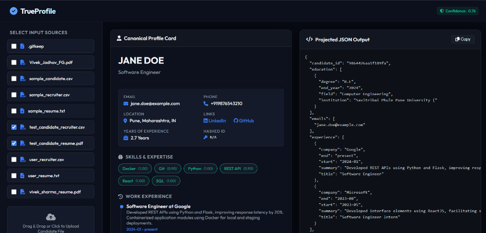

# TrueProfile

Ingest, normalize, deduplicate, and project multi-source candidate profiles with semantic skill mapping and trust-weighted confidence scoring.



## Table of Contents
- [Features](#features)
  - [Multi-Source Ingestion](#multi-source-ingestion)
  - [Normalization Engine](#normalization-engine)
  - [Merge & Deduplication](#merge--deduplication)
  - [Confidence Scoring](#confidence-scoring)
  - [Configurable Output Projection](#configurable-output-projection)
- [System Architecture Overview](#system-architecture-overview)
- [Design Decisions & Reasoning](#design-decisions--reasoning)
- [Tech Stack](#tech-stack)
- [Getting Started](#getting-started)
- [Edge Cases Handled](#edge-cases-handled)
- [Demo Video](#demo-video)
- [Contact](#contact)

---

## Features

### Multi-Source Ingestion
* **Resilient Document Parsing**: Reads and parses unstructured PDF/TXT resumes using custom section-matching heuristics, filtering out layout/visual dividers, and falling back to Anthropic Claude LLM extraction when credentials are set.
* **CSV Spreadsheets**: Automatically extracts structured rows from recruiter sheets, supporting header variations via key normalization.
* **GitHub Integration**: Connects to the GitHub API dynamically to fetch repositories, coding languages, and user profiles, enriching candidate technical skills.
* **ATS JSON Blobs**: Extracts parsed application tracking system outputs using JSON schemas.

### Normalization Engine
* **Phone Standardizer**: Normalizes international telephone inputs to the E.164 standard using the Google `phonenumbers` port, defaulting to the `"IN"` (India) country code.
* **Date Standardizer**: Resolves complex, unstructured date formats and intervals into standard `YYYY-MM` representation. Treats `"Present"` or `"Current"` as active reference dates.
* **Semantic Skill Canonicalization**: Performs cosine-similarity skills alignment using a sentence-transformer model (`all-MiniLM-L6-v2`), grouping synonymous or misspelled tech keywords into canon lists.

### Merge & Deduplication
* **Fuzzy Deduplication**: Consolidates multiple source records into a single merged profile.
* **Conflict Resolution Policy**: Merges list fields (like education, experience) based on logical matching rules (e.g. merging jobs that share the same title and time range, or mapping degree abbreviations like `B.E.` -> `Bachelor of Engineering`).
* **Acronym Mapping**: Automatically matches abbreviations (like `SPPU` -> `Savitribai Phule Pune University`).

### Confidence Scoring
* **Field-Level Confidence**: Assigns scoring metrics to each field (`0.0` to `1.0`) based on value presence (`+0.5`), agreement between multiple sources (`+0.2`), critical profile fields like email/name (`+0.2`), and high-fidelity source trust (`+0.2`).
* **Overall Confidence**: Calculates a weighted average score across populated candidate details.

### Configurable Output Projection
* **Runtime JSON Configuration**: Maps paths, splits indexes, and supports dot-notation paths (e.g. `links.github`).
* **Field Renaming**: Allows dynamic output renaming at runtime.
* **Missing-Value Policies**: Configurable options for handling missing fields: `null` (inserts default values), `omit` (skips keys), or `error` (raises exceptions).

---

## System Architecture Overview

### High-Level Flow
```
CSV/PDF Input ➔ Extract ➔ Normalize ➔ Merge ➔ Confidence ➔ Project ➔ Validate ➔ Canonical JSON Output
```

### Architecture Diagram
`[INSERT ARCHITECTURE DIAGRAM IMAGE HERE]`

### Data Flow Diagram
`[INSERT DATA FLOW DIAGRAM IMAGE HERE]`

---

## Design Decisions & Reasoning

* **Merge Key Strategy**: Consolidates experience entries by comparing overlapping dates and exact matching titles. If a candidate holds the same role during the exact same time interval, it is mathematically consolidated to prevent duplication.
* **Source Priority Order**: Set to `resume` (5) > `linkedin` (4) > `github` (3) > `ats_json` (2) > `recruiter_csv` (1). This prioritizes high-fidelity, candidate-submitted documents over third-party spreadsheets.
* **Confidence Scoring Rules**: Populated values start at a baseline of `0.5`, with additions for critical fields (name/email) and trusted sources, yielding scores like `0.9` for verified emails instead of lower arbitrary averages.
* **Separated Projection Layer**: Decoupled the canonical merging system from the user-facing output projection. This ensures downstream API consumers can customize naming conventions and missing policies without affecting the core data collection.
* **Trade-offs**: Chose advanced regex rules for fallback text parsers over a full transformer model to ensure zero-cost local execution during Claude API rate-limiting or network issues.

---

## Tech Stack

| Layer | Technology |
| :--- | :--- |
| **Backend** | Python 3.13 / Flask (Web App) / Click (CLI) |
| **Frontend** | HTML5 / CSS3 (Vanilla Dark Mode theme) / JavaScript (ES6+) |
| **AI/LLM** | Anthropic Claude SDK (fallback parser) |
| **Semantic Extraction** | Sentence-Transformers (`all-MiniLM-L6-v2` via PyTorch) |
| **PDF Parsing** | `pdfplumber` |
| **Validation** | `jsonschema` (Draft-07 schema compliance) |

---

## Getting Started

### Clone & Install
```bash
# Clone the repository
git clone https://github.com/vivekjadhav23/TrueProfile.git
cd TrueProfile

# Install dependencies
pip install -r candidate_transformer/requirements.txt
```

### Environment Variables
Optionally configure keys for full API ingestion capabilities:
```bash
export ANTHROPIC_API_KEY="your-anthropic-key"
export GITHUB_TOKEN="your-github-token"
```

### Run Dev Server
```bash
# Run Flask web interface
python -m candidate_transformer.ui.app
```

### Open in Browser
Open **[http://127.0.0.1:8000/](http://127.0.0.1:8000/)** in your browser to access the TrueProfile interface.

---

## Edge Cases Handled
* **Font CID Bullets**: Strip PDF font artifacts like `(cid:127)` from summaries.
* **Present Date Margins**: Resolves years of experience metrics by matching `"Present"` as June 2026.
* **Layout Divider Cleaning**: Automatically removes line breaks consisting of repeat characters (e.g. `-----`).
* **Degree Splitting**: Safely splits `"B.E. Computer Engineering"` into degree `"B.E."` and field `"Computer Engineering"`.
* **Grade Filtering**: Prevents exam ranks or CGPA lines containing `"College Topper"` from creating false university entries.

---

## Demo Video
`[INSERT DEMO VIDEO LINK/EMBED HERE]`

---

## Contact
* **Name**: Vivek Jadhav
* **GitHub**: [vivekjadhav23](https://github.com/vivekjadhav23)
* **LinkedIn**: [vivek-jadhav-m23](https://linkedin.com/in/vivek-jadhav-m23)
